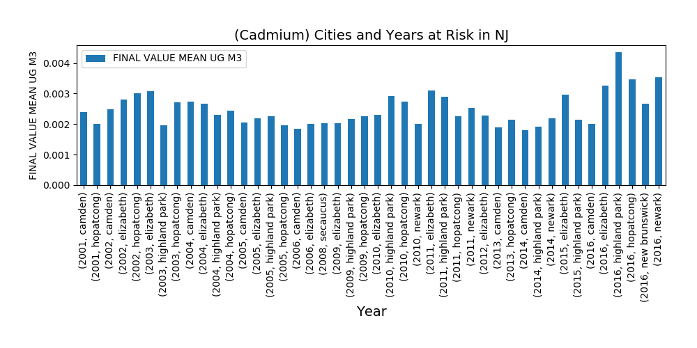
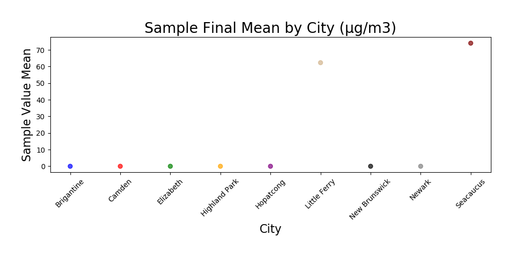
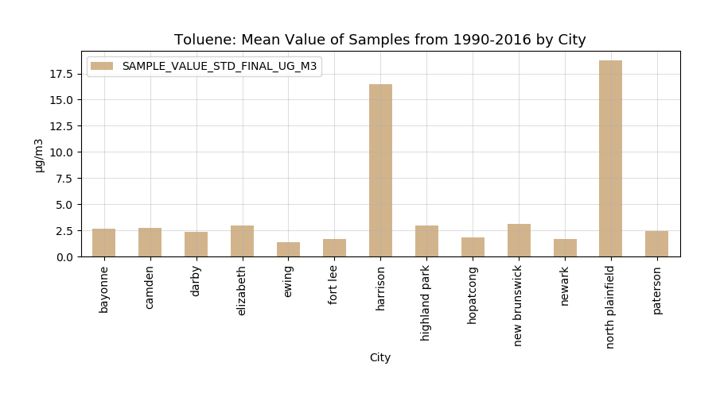
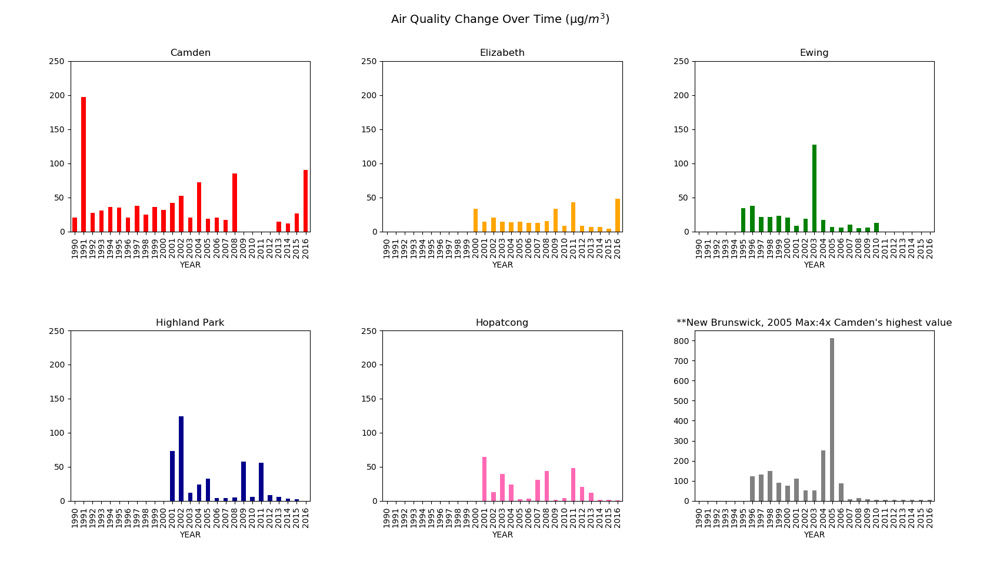

# Major Findings in the EDA for Historical Air Quality
## Project 1, Group 6

* We looked into Historical Air quality data in New Jersey over the last few decades.

### Github Participants:
* @jefferyb92 - Jeffrey Burgos
* @mariavpatino - Victoria Patiño 
* @jjjjjeb - Jamie Bruno
* @angievizca - Angelica Vizcaino

## Project Proposal:

We planned to analyse air quality in New Jersey over the past thirty years. We planned to examine the relationships between Toxic Air Pollutants in different locations throughout New Jersey, where these pollutants have been sampled, and to discover trends in reported values.

## Guiding Questions: 

1. What are some Toxic Air Pollutants that are potentially dangerous to human health? 
2. Can they be found in New Jersey?
3. Are the levels found in New Jersey harmful to humans?

## Finding the data:
Process: 
* Kaggle → 
    * EPA Historical Air Quality → 
        * US Environmental Protection Agency →
            * Ambient Monitoring Archive of Hazardous Air Pollutants found at [EPA Toxics Data Archive](https://www3.epa.gov/ttn/amtic/toxdat.html#data)

## Final Data Source:

We used the Ambient Monitoring Archive of Hazardous Air Pollutants because it had the best historical source of data, specifically relative to NJ. We then settled on the following Pollutants:
1. Benzene
    * Formed from both nature & human activity. Some industries use benzene in the process that makes paint, plastics, lubricants, rubbers, dyes, detergents, drugs, and pesticides. Natural sources include fires.
2. Cadmium
    * Occurs naturally and is released into the air in mining and smelting operatations. Also used in fertilizers, pigments, and batteries.
3. Chromium
    * Released into the air from fuel combustion and metal industries.
4. Toluene
    * Used to make benzene.  Used in industry to make chemicals, rubber and plastics, in solvents, and in paints and lacquers.

## Initial Exploration into the 'Harmful Effects' of our chosen substances:
### Hazardous exposure to our chosen pollutants results in the following effects as dependent on level of exposure:
1. Cancer, including lung, kidney, bone, stomach
2. Harm to the nervous system and brain
3. Birth defects
4. Irritation to the eyes, nose and throat
5. Coughing and wheezing
6. Impaired lung function
7. Harm to the cardiovascular system
8. Reduced fertility

# Analysis of all Data Sets
## Benzene, Cadmium, Chromium, Toluene
* We decided to use the sampling measurement 'mg/m3' because this measurement is an international standard. 
* The dataset included coordinates for testing locations.  We used the citypy module to get the nearest city to the testing location.
* In some instances we used the gmaps module to illustrate the mapping of sampling locations where a specific toxin recorded levels registered as high risk to human health.
* The benzene and toluene data sample results show the most similarities with high values before 1995 and high averages across all the years in Harrison and North Plainfield.  Because Toluene is used to produce Benzene and because both are used in the production of paint, perhaps there were a higher number of paint-producing factories in these locations.  
* Additional reflections

# Toxic Pollutant Highlights

## Benzene

### How has the air quality changed overall over the course of the past 30 years?
The air quality in terms of Benzene specifically, was on the decline over the last 30 years for the most part. However, in the years 2015 and 2016, the amount of Benzene appeared to be on the rise in the areas that were observed, with the addition of Bayonne and Newark being observed in those years and not the years prior.

### What were the mean values for the air quality in specific cities?
In terms of specific cities, most were below 1 microgram per cubic meter, with the exceptions of Camden, Darby, Elizabeth, North Plainfield, and Harrison. North Plainfield and Harrison had the highest recorded mean values, having around 4 micrograms per cubic meters, and 3 micrograms per cubic meter respectively. Although the had the highest mean values, they had less than ten years of observational data, each having about 7 years, whereas others had more than 10 and some with more than 20 years of observational data.

### How had the air quality changed in cities with more than 10 years of observational data?
Of the cities that had more than 10 years of observational data, they pretty much all had a decline in how much Benzene was in the air over the years, albeit a year here or there that had a small spike. One of the cities that had the most significant improvements in terms of air quality was Camden, that had mean values of over 4 micrograms per cubic meters in 1990, to under 1 microgram per cubic meter in 2016. Elizabeth on the other hand, while improving in air quality over time, actually had an increase in Benzene in 2016, growing to about 1.5 micrograms per cubic meter, as opposed to being under 1 microgram per cubic meter the year prior.

### How do the cities compare over time?
In conclusion, over time pretty much all the cities have made efforts to reduce the amount of Benzene in the air, whether it be due tighter regulations from the government, or from less people smoking cigarettes and the like, with small exception of course. If things continue to go down this route, I’m sure most if not all the cities will be under 1 microgram per cubic meter, which while I can’t say with certainty is considered “safe” levels, is certainly much safer than the levels that were shown in the previous years.

## Cadmium:

### Risk Level
EPA calculated an inhalation unit risk estimate of 1.8 × 10 -3 (µg/m 3 ) -1 . (0.0018 µg/m 3) (per day) [Ref](https://www.epa.gov/sites/production/files/2016-09/documents/cadmium-compounds.pdf) / [Ref 2](https://cfpub.epa.gov/ncea/iris/iris_documents/documents/subst/0141_summary.pdf#nameddest=cancerinhal)

### How has the average air quality in terms of toxins changed in the last 20 to 30 years overall in New Jersey?

### How has the air quality improved in areas that have had observations of 10 years or more?
For the Cadmium data the average air quality is not steady and fluctuates, but the last 3 years evaluated (204 to 2016) shows an increase of this toxins for the Cities of Camden, Highland Park, Elizabeth and Hopatcong, and and increase of last year evaluated (2016) for Newark and New Brunswick.

## Additional Observations for Cadmium
### What Years have more Risk of getting cancer?
Out of the 18 years studied in the data(from 2002 to 2016) by getting the mean values of each year for the state of New Jersey, the only years that were not at risk of getting cancer by inhaling more than 0.0018 µg/m 3 for 24 hours were 2006 to 2008 and 2013 to 2014 . We can see that the mean values fluctuate over the 18 years, and are not consistent and not steady. Which may represent a risk or uncertainty in the upcoming years.

### What Cities in NJ have the highest risk of getting cancer? have higher concentration of Risk Estimate by EPA 0.0018 µg/m 3) (per day)

By grouping the data by year and city, we can calculate the mean values, and extract the years and cities with mean values in µg/m 3 higher than EPA at Risk estimate of 0.0018 µg/m 3 (per day). We can see that the year of 2016 has the highest risk with the cities of Newark, Hopatcong, and Highland Park. Been Highland Park the City with the highest mean value and at higher risk with a mean value of 0.004366 µg/m 3 for 24 hours. Which represents a higher probability for this population of getting cancer by inhaling Cadmium with this values over the lifetime. 

## Chromium 

### How has the air quality changed overall over the course of the past 30 years?
According to the graph: “Chromium (microg/c3) by Year in NJ”, the air quality in terms of the presence of chromium toxin has been constant since 1991 mostly throughout the State of New Jersey (in cities where it has been measured). However, in 2007 and 2008, the levels of this toxin reached levels of concern for health in the cities of Little Ferry and especially Secaucus (based on the Air Quality Index (AQI) - Particulate matter).

### What were the mean values for the air quality in specific cities?
* In terms of specific cities, most were below 1 microgram per cubic meter, with the exception of Little Ferry and Secaucus. These cities showed the highest average values ​​reported, with levels above 35.5 during the years of 2007 and 2008, which according to the AQI - Particulate matter, are levels that would affect the population with serious health effects.

### Are the levels of Chromium in the air dangerous for the human's health?

#### PM2.5 AQI breakpoints

To know if the values registered are dangerous or not, we need to compare them with an index and in this case with the Air Quality Index, the Fine Particulate Matter that measures the level of air pollutants in the air.

* After the registered levels of chromium were filtered, the results were:

People who were in those cities (Little Ferry and Secaucus) were exposed to the toxin and may have experienced serious health effects because the toxin levels found in the area were in the categories that could be: Unhealthy for sensitive groups, unhealthy and very unhealthy.

The heat map shows exposure to dangerous levels in one place and is Secaucus (around wetlands). The value shown is high; that is, within the index we talk about levels of up to 500 and the value is shown reaches 800. This could be given for two reasons:

1. The person who registered the data in the database made a human error and typed the wrong value.
2. An important event occurred on the day of sampling.

### How do the cities compare over time?
* Over the years, all cities have shown a constant amount of chromium in the air (within healthy levels for the human being), this may be due to stricter government regulations to companies that have combustion and metal industry processes since these are the main sources that release this chemical element to the environment.

## Toluene
### Risk Type:
Source: [EPA Toluene Overview; Includes National Institute of Occupational Safety & Health, Occupational Safety and Health Administration Citations on Risk Levels](https://www.epa.gov/sites/production/files/2016-09/documents/toluene.pdf)
* The central nervous system (CNS) is the primary target organ for toluene toxicity in both humans. CNS dysfunction and narcosis have been frequently observed in humans exposed to elevated airborne levels of toluene; symptoms include fatigue, sleepiness, headaches, and nausea with serious exposure causing swollen liver, congestion & hemorrhage of the lungs, and tubular kidney necrosis. Toluene has not been proven to be carcinogenic. (Source: epa.gov)
### Risk Level: 
* Causing Death in 50% of Tested Subjects: 33,176 mg/m3 (rats) / 20,056 mg/m3 (mice)
* Immediately Dangerous to Life : 18,885 mg/m 
* Short Term Exposure Limit (15 Minute): 560 mg/m3
* Long Term Exposure Limit (8-10 Hours):  NIOSH: 375 mg/m3 / OSHA: 754 mg/m3 (?)

### How has the air quality changed overall over the course of the past 30 years
According to the Data Set, NJ’s Toluene air sampling values are trending downward and have overall reduced.

Toluene: The Yearly Average of all Testing Sites Combined

### Which cities suffered more from high levels of this pollutant overall?
* Harrison and North Plainfield have the highest mean across all the years. (Fig 2)
* When looking at the values please keep in mind: There were 18 Testing Sites for Toluene Sampling.  After CityPy these 18 sites were reduced to 13 sites: Data was combined from two sites in Elizabeth and three sites in Paterson. (Fig 3)  None of these averages reached hazardous levels.

Figure 2: Toluene Average Values over all timesets per city

Figure 3: Toluene Average Values over all timesets per Latitude

### A closer look:  Showing City Averages...
* There is a lack of data per city before 1995. Overall datasets per city are incomplete. The highest averages are registered before 1995.  Most pre-1995 testing sites ending tests completely. 
* Camden registered the highest average in 1991, with a downward trend until 2008. After a few years of no data 2013 sampling jumps with higher averages still up 2016.

Figure 4: Tracking Toluene Samples per City over the years

Figure 5: Toluene Sampling Averages for Cities with over 10 Years of Data

### … & Max Values over time: A look into the max values illustrates another story. 
* Here we see values over hazardous levels in Camden, Ewing, Harrison, Highland Park, New Brunswick, and Paterson. 
* * Where are solvent and paint industries located in NJ?
* * Did Rutgers facilities decide to paint their buildings in 2005 without notifying the Air Sampling Administrators (therefore skewing their entire data set) or was there some kind of chemical spill?

Figure 6: Max Value per Year over Time

Figure 7: Toluene Max Values, City Highlights

